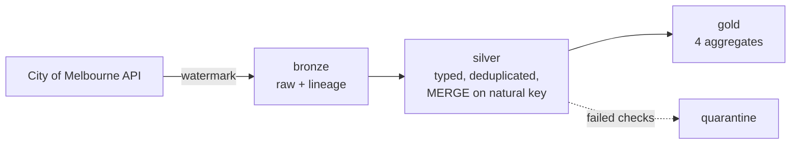

# Melbourne Pedestrian Lakehouse

I built a data pipeline over the City of Melbourne's pedestrian sensor network — the
counters dotted around the CBD that log how many people walk past each hour. The data is
public, it updates continuously, and it has enough real-world mess in it to be worth
engineering properly.

This is the project I used to learn lakehouse architecture end to end: incremental
ingestion, bronze/silver/gold layers in Delta, data quality gates, and tests that run on
every push.


## What I ended up with

- **150,000 hourly readings** from **134 sensors**, covering 28 Sep – 12 Dec 2024
- Four gold tables that answer specific questions, built from raw API output
- A data quality score of **88.2/100**, with 2.4% of rows quarantined instead of dropped
- 26 unit tests running in GitHub Actions

## What the data actually says

**Southbank Promenade is the busiest spot in the city** — 2.51 million counts over the
period, ahead of Town Hall at 2.35 million and Flinders Street at 2.19 million. When I
first saw this I checked it against my own sense of the city, and it holds up. If the
pipeline had told me some quiet side street was the busiest place in Melbourne, I'd have
gone looking for a bug.

| Location | Pedestrians |
|---|---|
| Southbank Promenade | 2,512,477 |
| Town Hall (West) | 2,346,145 |
| Elizabeth St – Flinders St (East) | 2,188,817 |
| Flinders La – Swanston St (West) | 2,063,970 |
| QV2 Apartments, 300 Swanston St | 1,999,626 |

**Southern Cross Station basically empties at weekends.** Weekend foot traffic there runs
at 15% of weekday levels — the sharpest drop anywhere in the network. That makes sense for
a station built around commuters and regional services, but it's satisfying to see it fall
straight out of the data.

**The city peaks at 5pm**, averaging around 830 people per sensor per hour, with a smaller
bump at 1pm for lunch.

**Of the 94 locations I could classify: 20 are commuter-driven, 46 balanced, and 28 are
destinations.** The commuter ones cluster around stations and office streets. The
destinations are the places people travel *to* — Southbank, the markets, retail strips.

## How it's built



**Bronze** keeps the raw payload exactly as the API returned it, plus when I pulled it and
where from. Nothing is cleaned here. If I get a transformation wrong later, I replay from
bronze instead of hitting an API whose history might have changed.

**Silver** is where it becomes usable: types parsed, timestamps converted to Melbourne
time, rows deduplicated on sensor plus hour, sensor details joined on.

**Gold** is four tables shaped around actual questions, so anyone can query them without
knowing anything about the source.

**Quarantine** holds rows that failed a quality check, with the reason attached.

## Things I got wrong first, and fixed

**The time zone nearly caught me out.** The API doesn't return a timestamp — it returns
`sensing_date` and `hourday` as two separate columns, in Melbourne local time with no
offset. Stitching them together gives you a naive timestamp, and if you then read that as
UTC, every reading shifts by 10 or 11 hours. The evening peak quietly moves into the early
hours and nothing looks obviously broken. I convert local → UTC explicitly now, handling
the repeated hour when daylight saving ends and the skipped hour when it starts. There's a
test asserting a 6am reading stays at 6am.

**I assumed the field names.** They were wrong. The sensor key is `location_id`, not
`sensor_id`, and the measure is `pedestriancount`, not `hourly_counts` — this dataset
moved from Socrata to Opendatasoft at some point and the columns were renamed. Rather
than hard-coding names, the pipeline now resolves them at runtime against a list of
candidates and logs what it picked. A future rename is a one-line config change instead
of a broken pipeline.

**I hit the API's paging ceiling.** The records endpoint caps out at 10,000 rows per run.
It warns me now rather than silently truncating, and for a proper backfill there's a
separate bulk export path.

## Decisions I'd defend in an interview

**Incremental, not full reload.** A watermark tracks the newest date I've loaded, so each
run only asks for what's new. I fetch oldest-first deliberately — newest-first would leave
a hole if a run stopped halfway, and nothing later would notice.

**MERGE, not append.** Silver upserts on sensor plus timestamp, so re-running the same
window updates rows rather than duplicating them. There's a test that ingests the same
batch twice and checks the totals don't move.

**Quarantine, not drop.** Silently dropping bad rows is how a pipeline loses 4% of its
data for six months without anyone noticing. Failed rows get kept with a reason, and if
more than 1% of a batch fails, the job stops instead of poisoning the gold layer.

**Zero is a real number.** The publisher writes a count of zero when nobody walked past.
Treating that as missing would throw away genuine information about quiet streets.

## Honest note on where this runs

Databricks Free Edition has no outbound internet access, so the API call runs on my
machine and the bronze files get loaded into the lakehouse from there. Everything after
that — silver, gold, MERGE, quality gates, Unity Catalog — runs in Databricks.

`notebooks/01_bronze_ingest.py` has the in-cluster version for an environment that allows
egress. The local path in `src/pedestrian/ingest.py` is the one that's actually tested.

Having built it this way, the split is closer to how production systems work than I
expected: ingestion usually is a separate service writing into a landing zone, with the
warehouse reading from there.

## Tests

26 tests covering schema resolution, the quality checks, deduplication, time zone
conversion and the window-function logic. They use made-up data rather than live API
calls, so a flaky public endpoint never breaks my build.

```bash
pytest
```

## Gold tables

| Table | What it answers |
|---|---|
| `daily_location_counts` | How busy was each location each day, and how complete is the data? |
| `hourly_profile` | What does a typical day look like here? |
| `weekday_vs_weekend` | Commuter spot or destination? |
| `top_locations_monthly` | Who's rising and falling month to month? |

## Stack

Python, PySpark, Delta Lake, Databricks (Unity Catalog, volumes, SQL warehouse), dbt,
pandas, pytest, GitHub Actions

## Running it

```bash
python -m venv .venv && .venv\Scripts\activate
pip install -r requirements.txt && pip install -e .

python scripts/explore_api.py          # check the API schema first
python -m pedestrian.cli all --limit 5000
pytest
```

More detail in [RUN_ME.md](RUN_ME.md) and [docs/](docs/).

## What I'd do next

- Schedule it as a Databricks Workflow once ingestion runs somewhere with internet access
- Try Delta Live Tables so the expectations are declarative rather than hand-written
- Pull the minute-level dataset for near-real-time counts
- Alert when a sensor goes quiet for more than 24 hours — right now I'd only notice by looking

## Data

City of Melbourne Open Data Portal — Pedestrian Counting System (counts per hour) and
Sensor Locations, CC BY 4.0. The raw data isn't committed here.
