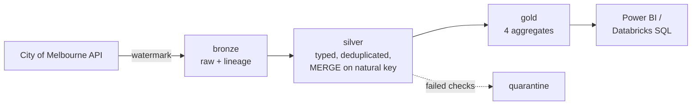

# Melbourne Pedestrian Lakehouse

> Fill in every `[placeholder]` once you have run the pipeline. Delete this line when done.

An incremental data pipeline over the City of Melbourne's pedestrian sensor network:
medallion architecture on Databricks, data quality gates with quarantine, orchestrated
daily, unit tested in CI.


## What this does

Every day the pipeline pulls new hourly pedestrian counts from the City of Melbourne's
public API, validates them, deduplicates and conforms them, and rebuilds four aggregate
tables that answer questions about how people move through the city.

- **[X] million readings** across **[X] sensors**, from **[date]** to **[date]**
- Runs in **[X] minutes**, scheduled daily with retries and failure alerts
- **[X]%** of rows quarantined by the quality gate

## Architecture



Full explanation, including why each layer exists: [docs/01_architecture.md](docs/01_architecture.md)

## Engineering decisions worth asking me about

**Incremental, not full reload.** A watermark tracks the newest timestamp loaded; each run
requests only newer rows. Records are fetched oldest-first, so a run that stops early
leaves a contiguous block rather than a gap.

**MERGE, not append.** Silver upserts on `sensor_id + event_ts_utc`, which makes a retried
run safe: the same window updates rows instead of duplicating them.

**Quarantine, not drop.** Rows failing a quality check go to their own table with a reason.
If more than 1% of a batch fails, the job stops rather than poisoning gold.

**Schema-drift tolerance.** This dataset has already moved platforms once and had its
columns renamed. Field names are resolved at runtime against a candidate list, so a rename
is a config change rather than an outage.

**Time zone handled once.** Melbourne is UTC+10, or UTC+11 in daylight saving. Conversion
happens in silver, so every gold table agrees and the morning peak lands in the right hour
all year.

Trade-offs behind each of these: [docs/03_decisions.md](docs/03_decisions.md)

## What the data says

- **Busiest location:** [sensor name] with [X] pedestrians over the period
- **Peak hour:** [X]:00, averaging [X] pedestrians
- **[X] locations are commuter-driven**, with weekend traffic below 70% of weekday levels
- [One more finding of your own]

## Gold tables

| Table | Question it answers |
|---|---|
| `daily_location_counts` | How busy was each location each day, and how complete is the data? |
| `hourly_profile` | What does a typical day look like at this location? |
| `weekday_vs_weekend` | Does this spot serve commuters or visitors? |
| `top_locations_monthly` | Who's rising and falling, month on month? |

Column-level documentation: [docs/02_data_dictionary.md](docs/02_data_dictionary.md)

## Data quality

[X] checks run between bronze and silver, scored out of 100: null keys, unparseable
timestamps, negative and implausible counts, future timestamps, duplicates on the natural
key, and referential integrity against the sensor dimension.

One domain rule worth noting: **a count of zero is valid**. The publisher writes zero when
nobody passed the sensor, so treating zero as missing would delete real information about
quiet streets.

Latest report: [docs/data_quality_report.md](docs/data_quality_report.md)

## Orchestration


Databricks Workflows runs bronze → silver → gold daily at 05:30 Melbourne time, with
retries on the ingestion task (public APIs fail transiently) and email alerts on failure.
Definition: [jobs/workflow_job.json](jobs/workflow_job.json)

## Tests

[X] unit tests covering schema resolution, quality checks, deduplication, time zone
conversion and the window-function logic, running on every push via GitHub Actions.

The tests use fabricated frames rather than live API calls, so CI never fails because a
public endpoint is having a bad day.

```bash
pytest
```

## Tech stack

Python, PySpark, Delta Lake, Databricks (Unity Catalog, Workflows, SQL Warehouse), dbt,
pandas, pytest, GitHub Actions, Power BI

## Running it yourself

```bash
python -m venv .venv && .venv\Scripts\activate
pip install -r requirements.txt && pip install -e .

python scripts/explore_api.py            # confirm the API schema
python -m pedestrian.cli all --limit 5000
pytest
```

Databricks setup: [docs/04_databricks_setup.md](docs/04_databricks_setup.md)
Full command reference: [RUN_ME.md](RUN_ME.md)

## Next steps

- Delta Live Tables for declarative expectations instead of manual quality checks
- Ingest the past-hour minute-level dataset for near-real-time counts
- Alert when a sensor stops reporting for more than 24 hours
- Correlate foot traffic with weather and event calendars

## Data source

City of Melbourne Open Data Portal — Pedestrian Counting System (counts per hour) and
Sensor Locations, licensed CC BY 4.0. Raw data is not stored in this repository.
