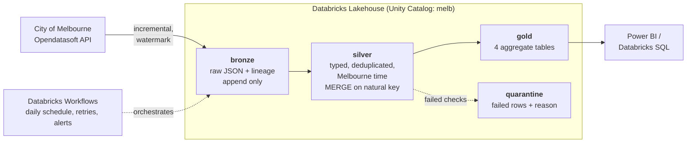

# Architecture

## Why each layer exists

**Bronze** is the receipt. Raw payload stored as JSON text with `_ingested_at_utc` and
`_source_dataset`. Nothing is cleaned here, so when a downstream transformation turns out
to be wrong we replay from bronze rather than re-pulling from an API whose history may
have changed. Schema-on-read means a new upstream column never breaks the load.

**Silver** is conformed. Types parsed, timestamps converted to Australia/Melbourne once,
rows deduplicated on the natural key (`sensor_id + event_ts_utc`), sensor dimension joined
on. Written with MERGE, not append, which is what makes re-running safe.

**Gold** is shaped for consumption. Four tables, each answering one question, documented
in Unity Catalog so an analyst can use them without reading any code.

**Quarantine** holds rows that failed a quality check, with the reason. Dropping them
silently is how a pipeline loses data for months without anyone noticing.

## Incremental loading

A watermark — the newest timestamp already loaded — is stored in a Delta table
(`melb.bronze.watermark`) and in `state/watermark.json` locally. Each run requests only
newer rows and advances the watermark at the end.

Three consequences worth being able to explain:

- Re-running twice does not duplicate data, because silver MERGEs on the natural key.
- A crash mid-run leaves the watermark unadvanced, so the next run re-fetches that window.
  That window is re-merged, not re-appended, so the result is the same either way.
- Records are requested **oldest first**. Newest-first would leave a gap if a run stopped
  early, and no later run would ever notice.

## Data quality gate

Checks run between bronze and silver: null keys, unparseable timestamps, non-numeric or
negative counts, implausibly large counts, future timestamps, duplicates on the natural
key, and referential integrity against the sensor dimension.

Rows that fail are quarantined with a reason. If more than **1%** of a batch fails, the
job stops rather than poisoning gold. That threshold is a judgement call, documented in
`config.py` so it can be argued with.

Note one domain rule that is easy to get wrong: **a count of zero is valid**. The
publisher writes a zero when nobody passed the sensor. Treating zero as missing would
delete real information about quiet streets.

## Schema drift

Field names change when a publisher migrates platforms — this dataset already moved from
Socrata to Opendatasoft and the columns were renamed. Rather than hard-coding one name,
`config.FIELD_CANDIDATES` lists likely names per logical field and the resolver picks
whichever the API returns today, logging its choice. A rename becomes a one-line config
change instead of a broken pipeline.

## Known upstream issues handled

- The publisher documents that sensors 67, 68 and 69 emit duplicate records. Deduplication
  handles them; the DQ report counts them separately so the issue stays visible.
- Sensors are decommissioned and relocated over time, so counts can reference a sensor no
  longer in the dimension. That is a warning, not a failure — the reading still happened.
- The hourly dataset is updated monthly, so freshness alerts are set to warn after 7 days
  and error after 14, not hours.
